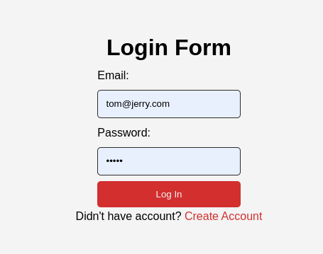
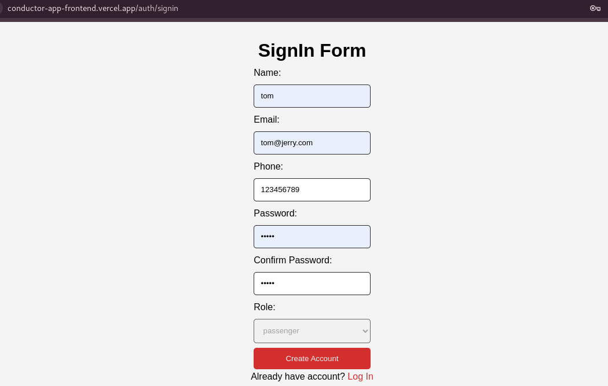
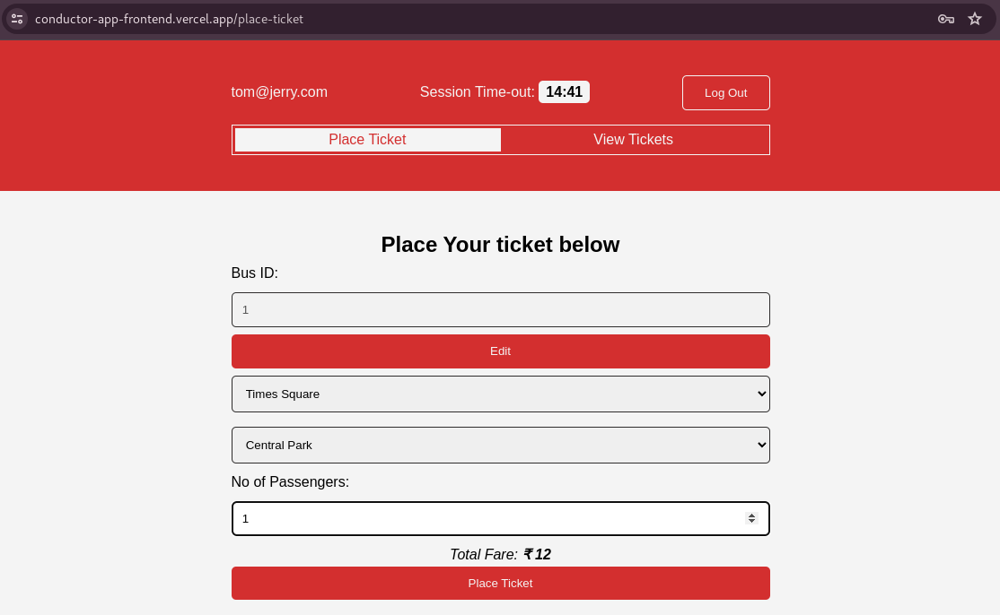
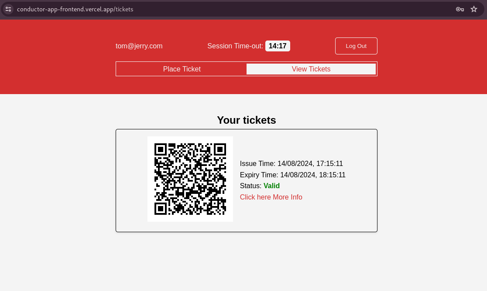

## How to Use the Conductor App
Welcome to the Conductor App! This guide will help you navigate and use the app to place and view tickets. The app is currently in its early stages, and your feedback is valuable for its improvement.

## Contents
- [How to Access the App](#1-access-the-app)
- [Authorization](#2-authorization)
- [Navigation](#3-navigation)
- [Placing a Ticket](#3-placing-a-ticket)
- [Viewing Tickets](#4-viewing-tickets)
- [Ticket Validation](#5-ticket-validation-under-development-in-progress)
- [Feedback & Validation](#feedback--validation)
- [POINT TO BE NOTED](#point-to-be-noted-)
- [Artfact](#artifacts)

### 1. Access the App:
Visit the [Conductor App](https://conductor-app-frontend.vercel.app) frontend hosted on Vercel. 

### 2. Authorization:
- Ensure you are logged in for certain actions like placing a ticket.
- You can create a New account using Create Account

### 3. Navigation:
Use the **Navbar** at the top to navigate between sections like **Place Ticket** and **View Tickets**.

### 3. Placing a Ticket:
- Click on **"Place Ticket"**.
- Enter Bus ID/Bus Number
- Them enter the source, destination and number of passengers.
- Submit to generate a ticket.

### 4. Viewing Tickets:
- Click on **"View Tickets"**.
- See a list of your tickets with details like ID and status.

### 5. Ticket Validation (Under Development) in Progress:
- View and validate tickets using QR codes or unique IDs. 

### Feedback & Validation:
After trying out the app, please provide your feedback on LinkedIn via DM/under my post.My LinkedID: [Barathan-LinkedIn](https://www.linkedin.com/in/barathan-rangarajan-614855214/).
Feel free to share your experience and suggestions.

### POINT TO BE NOTED !!!:
- The Backend is hosted in Render, where after 15 mins of idle time the server will shut down.
Hence kindly wait for few minutes while you are create your account. It might take long since server is getting started
- Considering cost, I am using SQLITE DB on Backend, hence every server restart create a fresh DB, so your account details and ticket details might not be available after server restart
- **This is just a demo app which I launch to get Idea Validation**

### Artifacts:

- Login Page

- SignIn Page

- Place Ticket

- View Ticket
